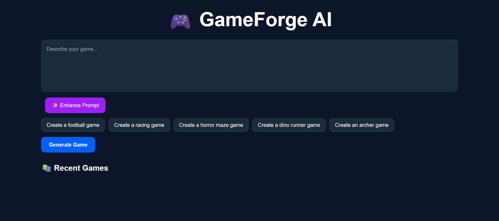
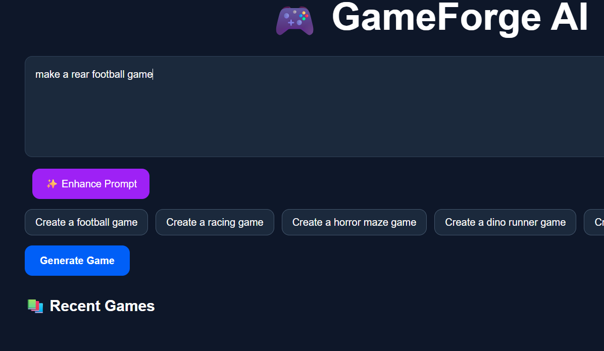

# 🎮 Game Maker — Turn Ideas Into Games

<p align="center">
  
  
  
</p>

<h3 align="center">🚀 From imagination to playable games.</h3>

<p align="center">
  An AI-powered game creation platform that transforms your ideas into interactive gaming experiences.
</p>

---

## 🌟 About The Project

**Game Maker** is an AI-powered platform designed to make game development easier and more accessible.

Turn your creative ideas into playable games using simple text prompts. Whether you're imagining a simple 2D adventure or an interactive gaming experience, Game Maker helps bring your vision to life.

Our goal is simple: **Make game creation accessible to everyone.**

---

---

## ✨ Features

* 🤖 **AI-Powered Game Generation** — Generate games from text prompts.
* 🎮 **Interactive Gameplay** — Turn ideas into playable experiences.
* ⚡ **Simple & Intuitive UI** — A clean interface for creating games.
* 🎨 **Creative Freedom** — Bring your unique game concepts to life.
* 🚀 **Game Preview** — Preview and test generated games.

---

## 🖥️ Tech Stack

> Update this section with the technologies used in your project.

* **Frontend:** React / Vite
* **Styling:** CSS / Tailwind CSS
* **AI Integration:** AI-powered game generation
* **Language:** JavaScript

---

## 📸 Screenshots

> Add screenshots of your application here.

<!-- Replace the image paths with your actual screenshot paths -->

| Home Page | Game Preview |
|:---:|:---:|
|  |  |

---

## ⚙️ Getting Started

Follow these steps to run Game Maker locally.

### Prerequisites

* Node.js
* npm
* Git

### Installation

**1. Clone the repository**

```bash
git clone YOUR_REPOSITORY_URL
```

**2. Navigate to the project directory**

```bash
cd YOUR_PROJECT_FOLDER
```

**3. Install dependencies**

```bash
npm install
```

**4. Start the development server**

```bash
npm run dev
```

**5. Open the local URL**

Open the URL shown in your terminal, usually:

```text
http://localhost:5173
```

---

## 🎮 How To Use

1. Open Game Maker.
2. Enter a prompt describing the game you want to create.
3. Generate your game using the AI features.
4. Preview and test your game.
5. Refine your idea and create something new!

---

## 🎬 Code Walkthrough

> Want to understand how Game Maker works under the hood?

📹 **Watch the code walkthrough here:**

[Add your YouTube code walkthrough link here](YOUR_CODE_VIDEO_URL)

---

## 🗺️ Roadmap

* [x] Initial project setup
* [x] User interface development
* [ ] AI-powered game generation
* [ ] More game templates
* [ ] Advanced customization options
* [ ] Improved game preview and testing
* [ ] Game export functionality

---

## 🤝 Contributing

Contributions, ideas, and feedback are welcome!

1. Fork the repository.
2. Create a new branch.
3. Make your changes.
4. Submit a pull request.

---

## 👨‍💻 Developer

**Ansh Pandey**

Building creative projects with code, AI, and imagination. 🚀

---

## 📜 License

This project is open-source. Add your preferred license to the repository before distributing it.

---

<p align="center">
  ⭐ If you like Game Maker, consider giving this repository a star!
</p>

<p align="center">
  <b>Made with ❤️ and lots of code.</b>
</p>
